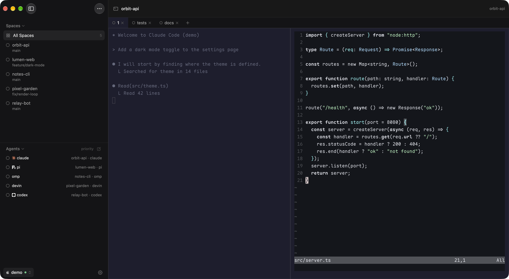
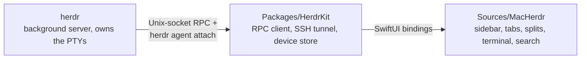

# MacHerdr

A native macOS console for [herdr](https://herdr.dev), the terminal workspace manager for
coding agents. It keeps herdr's basic layout and behavior (spaces, tabs, splits, agents, a real
terminal) and wraps it in a simple, Mac-native window. Local and remote (SSH) herdr hosts show
up in one sidebar.

> **Personal fork.** MacHerdr is a fork of [missuo/herdrm](https://github.com/missuo/herdrm),
> maintained for my own use. It is not a product: it will always be free, there are no
> releases or support, and the goal is to stay small. It keeps the upstream license
> ([PolyForm Noncommercial 1.0.0](LICENSE.md)); see [License](#license).

<p align="center">
  
</p>

## What it does

[herdr](https://herdr.dev) is the runtime your coding agents live on: a background server that
owns their terminals and knows which one is working, blocked, or done. MacHerdr is a native
window on top of it. The right pane is a real terminal attached to the agent's PTY, not a chat
wrapper.

- **Sidebar of Spaces and Agents.** Spaces (herdr workspaces) show a status ring and the git
  branch, with an ahead count, on local devices. Agents are one-line rows across every space,
  sorted by urgency (blocked, done, working, idle). The sidebar can collapse to a narrow status
  rail, and the divider between Spaces and Agents is draggable.
- **herdr's tabs and splits.** The selected space shows its herdr tabs across the top (status,
  rename, close, drag to reorder, new tab). A tab's panes are laid out exactly as herdr has
  them split, with draggable dividers, click to focus, and inactive panes dimmed.
- **herdr keybindings.** Your `[keys]` from `~/.config/herdr/config.toml` work: prefix chords
  and direct chords such as `ctrl+1..9` for workspaces.
- **Ghostty terminal.** Rendered by libghostty (Metal). Pick any bundled Ghostty theme in
  Settings, or import it from `~/.config/ghostty/config`. Light mode adapts ANSI colors so
  text does not wash out; Shift+Enter inserts a line break; selecting with the mouse copies
  and shows a brief "Copied" notice.
- **Local and remote devices.** Add SSH hosts (`user@host`, `user@host:port`, `ssh://` URIs, or
  `~/.ssh/config` aliases). Authentication tries OpenSSH keys and agent first, then Tailscale
  SSH, then a password prompt stored in the macOS Keychain. Each device reconnects on its own
  with backoff, and the bottom-left switcher filters the sidebar by device.
- **New Agent, New Terminal, New Space.** The agent picker lists only the CLIs found on the
  login-shell PATH locally, or the remote server's catalog over SSH. Shortcuts: Cmd+N new
  agent, Cmd+T new terminal, Shift+Cmd+N new space.
- **Search, files, notifications.**
  - Cmd+K searches every agent on every device, ordered by urgency.
  - A two-pane file manager browses Local and SSH devices and copies in either direction.
  - Files and images can be pasted into an agent's pane, locally or over SSH.
  - A system notification appears when an agent finishes or needs input; clicking it jumps
    straight to that agent.
- **Native look.** SwiftUI, light and dark appearance, an opaque sidebar, and Liquid Glass
  titlebar buttons on macOS 26.

## What it deliberately leaves out

The point of this fork is to stay simple and close to herdr's own TUI layout. Upstream
features that add extra UI or configuration are skipped on purpose (machine stats meters,
grazr account dials, per-agent launch arguments and YOLO mode). Upstream bug fixes are
cherry-picked when they touch paths this fork uses. What was taken and skipped is recorded in
[`docs/upstream-triage.md`](docs/upstream-triage.md). Auto-update is disabled.

## Requirements

- macOS 14 or later
- [herdr](https://herdr.dev) installed locally (MacHerdr starts it if it is not running) and on
  any remote machine you add
- For remote devices: OpenSSH access, Tailscale SSH, or a Keychain-stored password

## Build and install

There are no prebuilt releases. Build it yourself:

```sh
brew install xcodegen
xcodebuild -downloadComponent MetalToolchain   # once; libghostty compiles a Metal shader
make build      # Debug build: build/Build/Products/Debug/MacHerdr.app
make run
make install    # Release build, ad-hoc signed, replaces /Applications/MacHerdr.app
make kit-test   # HerdrKit tests (need a running local herdr)
```

## Architecture



- **[herdr](https://herdr.dev)**: the daemon. It owns every agent's PTY, persists spaces, and
  answers over a local Unix socket.
- **`Packages/HerdrKit`**: the transport and domain layer (NDJSON RPC, SSH tunnel, device
  store, models). It is UI-independent and tested on its own with `make kit-test`.
- **`Sources/MacHerdr`**: the SwiftUI app. Each pane is an
  [libghostty](https://github.com/Lakr233/libghostty-spm) terminal fed by a local `forkpty`
  pump running `herdr agent attach`.

## Credits

- [missuo/herdrm](https://github.com/missuo/herdrm): the upstream project this is forked from.
- [herdr](https://herdr.dev): the agent runtime this app is a console for.
- [@lbr77](https://github.com/lbr77): the
  [herdr.tailcat](https://github.com/lbr77/herdr-plugin-tailcat) server plugin and the
  reference implementation the libghostty terminal migration builds on
  ([lbr77/herdrm](https://github.com/lbr77/herdrm)).
- [Heeler](https://github.com/ZingerLittleBee/Heeler): iOS herdr client; domain model and
  transport patterns.
- [waku](https://github.com/egoist/waku): sidebar design reference.
- [libghostty-spm](https://github.com/Lakr233/libghostty-spm): the Ghostty terminal engine
  (Metal), by [@Lakr233](https://github.com/Lakr233).
- [Lobe Icons](https://github.com/lobehub/lobe-icons) and
  [Simple Icons](https://simpleicons.org): brand icons.

## License

This fork is for my personal use only and will always be free. It keeps the upstream license
unchanged: [PolyForm Noncommercial 1.0.0](LICENSE.md). You may use, modify, and share it for
any noncommercial purpose; commercial use requires a separate license from the upstream
maintainer.
